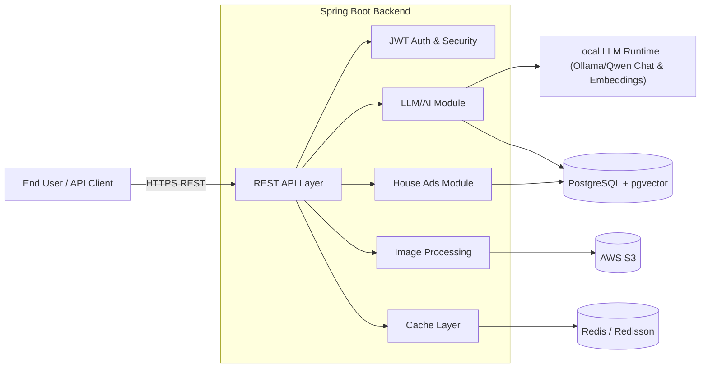

<p align="center">
  <picture>
    <!-- Optional dark-mode version -->
    <source media="(prefers-color-scheme: dark)" srcset="assets/DreamHouse AI Logo Design.png">
    <!-- Light/default -->
    
  </picture>
</p>

<h1 align="center">FindYourDreamHouseAI 🏠</h1>
<p align="center">AI-powered intelligent real estate search & recommendations</p>


<p align="center">

  <!-- Core stack -->
<a href="./pom.xml"></a>
<a href="./pom.xml"></a>
<a href="./pom.xml"></a>
<a href="#"></a>
<a href="#"></a>
<a href="#"></a>
<a href="#"></a>
<a href="#"></a>
<a href="#"></a>
<a href="#"></a>
<a href="#"></a>
<a href="#"></a>
<a href="#"></a>

</p>


FindYourDreamHouseAI is an **AI-powered real estate search platform** that lets users search for properties using **images and natural language**, backed by:

- Local **Qwen vision + LLM models** (no data leaves the system)
- **Vector similarity search** with pgvector for intelligent matching
- A secure, production-grade **Spring Boot** backend with JWT auth, caching, and AWS S3 integration


> ### 🔍 At a Glance
> - **Type:** Backend-heavy AI application (Spring Boot, LangChain4j, Qwen, Postgres, Redis, AWS)
> - **Focus:** AI-powered property search (images + natural language) with local LLMs and vector search
> - **Demonstrates:** Backend architecture, AI integration, security (JWT A256GCM), caching, AWS, pgvector, and production-ready design

## 💼 Why This Project Matters

This project is part of my portfolio to demonstrate that I can:

- Build **production-grade backend systems** with Spring Boot and modern Java.
- Integrate **local LLMs and vision models** (Qwen) into real products using LangChain4j.
- Design **secure, scalable architectures** with JWT auth, AWS, Redis, and Postgres.
- Work end-to-end: from **API design** and **data modeling** to **deployment and troubleshooting**.


## 👨‍💻 My Role (Berk Delibalta)

- Designed the overall **backend architecture** (Spring Boot 3, Java 25, modular package structure).
- Implemented **JWT-based authentication** with encrypted tokens (A256GCM) and Spring Security 6.
- Built the **AI integration layer** with LangChain4j, Qwen LLMs, and Qwen-VL for image + text search.
- Engineered the **vector search pipeline** using Qwen embeddings + pgvector in PostgreSQL.
- Integrated **AWS S3 + Secrets Manager** for secure image storage and configuration management.
- Implemented **multi-level caching** with Redis + Caffeine and distributed locking for performance.
- Defined **REST APIs** for house ads, messaging, AI search, and image upload, with full request/response models.
- Wrote configuration for **Dockerized deployments**, environment-based configs, and production-readiness.


## 🚀 Quick Start

```bash
# Clone the repository
git clone https://github.com/berkde/findYourDreamHouseAI.git
cd FindYourDreamHouseAI

# Configure AWS Secrets Manager (see Configuration section)
# Start PostgreSQL database

# Build and run
mvn clean package -DskipTests
mvn spring-boot:run
```

**API Documentation**: [Complete API Reference](./docs/API.md)  
**Developer Guide**: [Setup & Development](./docs/DEVELOPER.md)  
**Deployment Guide**: [Production Deployment](./docs/DEPLOYMENT.md)


## ✨ Features

### 🤖 AI-Powered Search & Recommendations
- **Intelligent Image Search**: Upload property photos to find visually similar listings using Qwen Vision model
- **Natural Language Queries**: Search properties using conversational language with LangChain4j AI agents
- **Vector Similarity Search**: Advanced embedding-based property matching using Qwen embeddings and pgvector
- **Smart Property Analysis**: AI-powered property feature extraction and description generation
- **Context-Aware Recommendations**: Personalized suggestions based on user preferences and behavior
- **Complete Data Privacy**: All AI processing happens locally with Qwen models

### 🔐 Authentication & Security
- **JWT-based Authentication** with encrypted tokens (A256GCM)
- **Role-based Access Control** (RBAC) with Spring Security 6
- **BCrypt password hashing** for secure user credentials
- **Stateless session management** for scalability
- **CORS configuration** for cross-origin requests

### 🏠 House Advertisement Management
- **CRUD operations** for house listings with rich metadata
- **Image upload and storage** via AWS S3 with automatic resizing
- **Presigned URLs** for secure image viewing
- **Advanced search functionality** by title, description, and AI-generated features
- **Multi-image support** with thumbnail generation
- **Property specifications** including beds, baths, price, location, and amenities

### 💬 Messaging System
- **Real-time messaging** between users and property owners
- **Message threading** per house advertisement
- **Contact information** management
- **Message history** and retrieval
- **Email and phone integration** for direct communication

### ☁️ AWS Integration
- **S3 storage** for image assets with server-side encryption
- **AWS Secrets Manager** for secure configuration management
- **Presigned URLs** for secure file access
- **Regional configuration** support
- **CloudWatch integration** for monitoring and metrics

### 🗄️ Database & Persistence
- **PostgreSQL** with Spring Data JPA and pgvector extension
- **Automatic schema management** with Hibernate
- **Connection pooling** with HikariCP
- **Transaction management** and data integrity
- **Vector embeddings** storage for AI-powered search

### ⚡ Performance & Caching
- **Multi-level caching** with Caffeine and Redis
- **Query optimization** with distributed locking
- **Request throttling** and rate limiting
- **Image processing** with automatic resizing and compression
- **Connection pooling** and database optimization

## 🏗️ Architecture

### System Overview (Mermaid)




For detailed diagrams (containers, sequences, and AI agents orchestration), see [docs/ARCHITECTURE.md](./docs/ARCHITECTURE.md).

### Module Structure
```
com.dreamhouse.ai/
├── authentication/          # User management & security
│   ├── configuration/       # Security filters & configs
│   ├── controller/          # Auth REST endpoints
│   ├── service/            # User business logic
│   └── model/              # User entities & DTOs
├── house/                  # Property management
│   ├── controller/         # House ad REST endpoints
│   ├── service/           # House business logic
│   └── model/             # House entities & DTOs
├── llm/                   # AI/LLM integration
│   ├── controller/        # AI search endpoints
│   ├── service/           # AI agents & tools
│   ├── tool/              # LangChain4j tools
│   └── model/             # AI request/response models
├── cloud/                 # AWS integration
│   ├── service/           # S3 & Secrets Manager
│   └── configuration/     # AWS configs
├── cache/                 # Caching layer
│   ├── service/           # Cache implementations
│   └── configuration/     # Cache configs
└── mapper/                # Object mapping utilities
```

## 🛠️ Technology Stack

| Component | Technology | Version                          | Purpose |
|-----------|------------|----------------------------------|---------|
| **Runtime** | Java | 25                               | Application runtime |
| **Framework** | Spring Boot | 3.5.4                            | Application framework |
| **Security** | Spring Security | 6.5.2                            | Authentication & authorization |
| **Database** | PostgreSQL + pgvector | Latest                           | Primary data store + vector search |
| **ORM** | Spring Data JPA | 3.5.4                            | Data persistence |
| **AI Framework** | LangChain4j | 1.8.0                            | AI agent orchestration |
| **AI Models** | Qwen Vision & LLM | Local                            | Image analysis & text generation |
| **AI Embeddings** | Qwen Embeddings | Local                            | Vector similarity search |
| **Cloud** | AWS SDK | 2.31.78                          | S3, Secrets Manager, CloudWatch |
| **Caching** | Redis + Caffeine | Redisson 3.36.0 + Caffeine 3.1.8 | Distributed + local caching |
| **JWT** | JJWT | 0.12.6                           | Token management |
| **Mapping** | ModelMapper | 2.0.0                            | Object mapping |
| **Image Processing** | Thumbnailator | 0.4.20                           | Image resizing & compression |
| **Vector DB** | pgvector | 0.1.2                            | Vector similarity search |
| **Hibernate Vector** | hibernate-vector | 6.6.22.Final                     | Vector support for Hibernate |
| **Build** | Maven | 3.9+                             | Dependency management |


## 📋 Table of Contents

- [Quick Start](#-quick-start)
- [Features](#-features)
- [Architecture](#️-architecture)
- [Technology Stack](#️-technology-stack)
- [Prerequisites](#-prerequisites)
- [Configuration](#-configuration)
- [Installation & Setup](#-installation--setup)
- [API Documentation](#-api-documentation)
- [Security](#-security)
- [Database Schema](#-database-schema)
- [Deployment](#-deployment)
- [Troubleshooting](#-troubleshooting)
- [Contributing](#-contributing)
- [License](#-license)


## 📋 Prerequisites

Before you begin, ensure you have the following installed and configured:

### Required Software
- **Java 25** 
- **Maven 3.9+** for dependency management
- **PostgreSQL 12+** database server
- **Redis 7.0+** for caching
- **AWS CLI** (for configuration setup)
- **Qwen AI Model** (local installation)

### AWS Requirements
- **AWS Account** with appropriate permissions
- **AWS Credentials** configured (via AWS CLI, environment variables, or IAM roles)
- **S3 Bucket** for image storage
- **Secrets Manager** access for configuration

## ⚙️ Configuration

### 1. Database Configuration

The application uses PostgreSQL as the primary database. Update `src/main/resources/application.yaml`:

```yaml
spring:
  datasource:
    url: jdbc:postgresql://localhost:5432/findyourdreamhouse
    username: your_username
    password: your_password
```

### 2. AWS Secrets Manager Setup

Create the following secrets in AWS Secrets Manager:

```bash
# JWT Secret (32-byte Base64 encoded)
aws secretsmanager create-secret \
  --name jwt-secret \
  --secret-string "$(openssl rand -base64 32)"

# AWS Region
aws secretsmanager create-secret \
  --name region \
  --secret-string "us-east-2"

# S3 Bucket Name
aws secretsmanager create-secret \
  --name bucket_name \
  --secret-string "your-dreamhouse-bucket"

# S3 Base Path (optional)
aws secretsmanager create-secret \
  --name basePath \
  --secret-string "prod/"
```

### 3. Environment Variables (Recommended)

Configuration is managed via environment variables (see `src/main/resources/application.yaml`). Common variables:

- Database
  - `POSTGRESQL_URL` (e.g., `jdbc:postgresql://localhost:5432/findyourdreamhouse`)
  - `POSTGRESQL_USERNAME`
  - `POSTGRESQL_PASSWORD`
- Redis
  - `SPRING_DATA_REDIS_HOST` (defaults to `localhost` if not set via application.yaml)
  - `SPRING_DATA_REDIS_PORT` (defaults to `6379`)
- AWS / Logging
  - `AWS_REGION` (e.g., `us-east-1`)
  - `CLOUDWATCH_NAMESPACE`
  - `LOGS_FILE_LOCATION` (e.g., `logs/app.log`)
- Security
  - `S3_SECRET_KEY` (Secrets Manager secret id used to fetch JWT secret)
- LLM configuration
  - `LLM_URL`
  - `LLM_NATIVE_BASE_URL`
  - `AI_API_KEY`
  - `LLM_MODEL`
  - `LLM_TEMPERATURE`
  - `LLM_EMBEDDING_MODEL`
- Sonar (if used locally/CI)
  - `SONAR_LOGIN_KEY`
  - `SONAR_HOST_URL`

Example local setup:

```bash
export POSTGRESQL_URL=jdbc:postgresql://localhost:5432/findyourdreamhouse
export POSTGRESQL_USERNAME=your_username
export POSTGRESQL_PASSWORD=your_password
export AWS_REGION=us-east-1
export LOGS_FILE_LOCATION=logs/app.log
```

## 🚀 Installation & Setup

### Step 1: Clone and Setup

  ```bash
# Clone the repository
git clone https://github.com/berkde/findYourDreamHouseAI.git
  cd FindYourDreamHouseAI

# Verify Java version
java -version  # Should be 25

# Verify Maven installation
mvn -version  # Should be 3.9+
```

### Step 2: Database Setup

```bash
# Start PostgreSQL (using Docker)
docker run --name postgres-db \
  -e POSTGRES_DB=findyourdreamhouse \
  -e POSTGRES_USER=admin \
  -e POSTGRES_PASSWORD=admin \
  -p 5432:5432 \
  -d postgres:15

# Or install PostgreSQL locally and create database
createdb findyourdreamhouse
```

### Step 3: AWS Configuration

```bash
# Configure AWS credentials
aws configure

# Verify AWS access
aws sts get-caller-identity

# Create S3 bucket (if not exists)
aws s3 mb s3://your-dreamhouse-bucket
```

### Step 4: Build and Run

  ```bash
# Clean and build the project
mvn clean package -DskipTests

# Run the application
  mvn spring-boot:run

# Or run the JAR directly
java -jar target/FindYourDreamHouseAI-0.0.1-SNAPSHOT.jar
  ```

### Step 5: Verify Installation

  ```bash
# Test the application health
curl http://localhost:8080/actuator/health

# Test user registration
curl -X POST http://localhost:8080/api/v1/auth/register \
  -H "Content-Type: application/json" \
  -d '{
    "username": "testuser",
    "password": "testpass123",
    "name": "Test",
    "lastname": "User"
  }'

# Test login
curl -X POST http://localhost:8080/login \
    -H "Content-Type: application/json" \
  -d '{
    "username": "testuser",
    "password": "testpass123"
  }'
```

## 🤖 AI Capabilities

### Intelligent Image Search
Upload property photos to find visually similar listings:

```bash
# Upload image for similarity search
POST /api/v1/ai/similar
Content-Type: multipart/form-data

# Parameters:
# - file: Image file (JPEG, PNG, WebP)
# - k: Number of results (optional, default: 12)
# - cityHint: City filter (optional)
# - typeHint: Property type filter (optional)
# - bedsHint: Bedroom count filter (optional)
# - priceHint: Price range filter (optional)
```

**Response:**
```json
{
  "inferredDescription": {
    "style": "Modern",
    "exterior": "Brick facade",
    "stories": "2",
    "bed_bath_hint": "3 bed, 2 bath",
    "features": ["Garage", "Garden"],
    "condition": "Excellent",
    "notes": "Well-maintained property"
  },
  "results": [
    {
      "houseAdUid": "uuid",
      "title": "Similar Modern House",
      "price": 450000,
      "address": "123 Main St",
      "images": ["..."]
    }
  ],
  "appliedHints": {
    "city": "Boston",
    "type": "House",
    "beds": 3,
    "price": 450000
  }
}
```

### Natural Language Search
Search properties using conversational language:

```bash
# Natural language property search
POST /api/v1/ai/search
Content-Type: application/json

{
  "q": "I'm looking for a 3 bedroom house near Central Park in NYC under $500k"
}
```

**Response:**
```json
{
  "summary": "Found 15 properties matching your criteria",
  "houseAdDTOS": [
    {
      "houseAdUid": "uuid",
      "title": "Beautiful 3-Bedroom House",
      "description": "Spacious family home...",
      "price": 450000,
      "address": "789 Pine Street, NYC",
      "images": ["..."]
    }
  ]
}
```

## 📚 API Documentation

The complete API documentation is available in [docs/API.md](./docs/API.md).

### Quick API Examples

**Authentication:**
```bash
# Register new user
POST /api/v1/auth/register

# Login
POST /login

# Get user profile
GET /api/v1/user/{userId}
```

**House Management:**
```bash
# List all houses
GET /api/v1/houseAds

# Create house ad
POST /api/v1/houseAds/create

# Upload images
POST /api/v1/houseAds/{houseAdId}/images

# Send message
POST /api/v1/houseAds/message
```

**AI Search:**
```bash
# Natural language search
POST /api/v1/ai/search

# Image similarity search
POST /api/v1/ai/similar
```


## 🔐 Security

### Authentication Flow

The application uses JWT-based authentication with encrypted tokens:

1. **User Registration/Login** → JWT token generation
2. **Token Storage** → Encrypted and stored per user
3. **Request Authorization** → Token validation on protected endpoints
4. **Role-based Access** → RBAC for fine-grained permissions

### Security Features

- **Encrypted JWT Tokens** (A256GCM encryption)
- **BCrypt Password Hashing** (12 rounds)
- **Stateless Session Management**
- **CORS Configuration** (configurable for production)
- **CSRF Protection** (disabled for API usage)

### Public vs Protected Endpoints

**Public Endpoints:**
- `POST /login` - User authentication
- `POST /api/v1/auth/register` - User registration
- `GET /api/v1/houseAds` - List all house ads
- `GET /api/v1/houseAds/id/{id}` - Get specific house ad
- `GET /api/v1/houseAds/title?title={query}` - Search house ads

**Protected Endpoints:**
- All other endpoints require `Authorization: Bearer <token>`
- Role-based access control (ROLE_USER, ROLE_ADMIN)

## 🗄️ Database Schema

### Entity Relationships

```
UserEntity (1) ──→ (N) HouseAdEntity
    │                    │
    │                    │
    └──→ (N) AddressEntity    └──→ (N) HouseAdImageEntity
    │                           │
    └──→ (N) UserRoleEntity     └──→ (N) HouseAdMessageEntity
            │
            └──→ (1) RoleEntity ──→ (N) AuthorityEntity
```

### Key Entities

**UserEntity:**
- `userUid` (Primary Key)
- `username`, `password` (BCrypt hashed)
- `name`, `lastname`, `email`
- `authorizationToken` (JWT)
- `lastLogin`, `createdAt`, `updatedAt`

**HouseAdEntity:**
- `houseAdUid` (Primary Key)
- `title`, `description`, `price`, `address`
- `city`, `state`, `neighborhood`, `type`
- `beds`, `baths`, `parking`, `petsAllowed`
- `embedding` (Vector for AI similarity search)
- `user` (Foreign Key to UserEntity)
- `createdAt`, `updatedAt`

**HouseAdImageEntity:**
- `houseAdImageUid` (Primary Key)
- `imageName`, `imageUrl`, `imageType`
- `storageKey` (S3 key)
- `imageDescription`, `imageThumbnail`
- `houseAd` (Foreign Key to HouseAdEntity)

**HouseAdMessageEntity:**
- `messageUid` (Primary Key)
- `senderName`, `senderEmail`, `senderPhone`
- `subject`, `message`, `messageDate`
- `houseAd` (Foreign Key to HouseAdEntity)

## ☁️ AWS Integration

### S3 Storage Flow

```
Client Upload → HouseAdController → HouseAdsService → StorageService → S3 Bucket
     ↓
Image Metadata → Database Storage → Presigned URL Generation
```

### AWS Services Used

- **S3**: Image storage with server-side encryption (AES256)
- **Secrets Manager**: Secure configuration management
- **IAM**: Access control and permissions
- **CloudWatch**: Application monitoring and metrics

### AI Services Integration

- **Qwen Vision Model**: Local property image analysis and feature extraction
- **Qwen Embeddings**: Local vector generation for AI similarity search
- **LangChain4j**: AI agent orchestration and tool management
- **pgvector**: Vector similarity search in PostgreSQL
- **Local Processing**: Complete data privacy with on-premises AI models

### Configuration Management

All sensitive configuration is stored in AWS Secrets Manager:
- `jwt-secret`: JWT encryption key
- `region`: AWS region for services
- `bucket_name`: S3 bucket for image storage
- `basePath`: S3 object key prefix

### AI Configuration

Local AI services require additional environment variables:
- `LLM_URL`: Qwen API base URL (local endpoint)
- `LLM_NATIVE_BASE_URL`: Native LLM endpoint for local Qwen models
- `AI_API_KEY`: API key for Qwen service (if required)
- `LLM_MODEL`: Qwen model name (e.g., "qwen-vl-plus")
- `LLM_TEMPERATURE`: Model temperature (0.0-1.0)
- `LLM_EMBEDDING_MODEL`: Qwen embedding model name

## 🚨 Error Handling

### HTTP Status Codes

| Code | Description | Usage |
|------|-------------|-------|
| 200 | OK | Successful operations |
| 201 | Created | Resource creation |
| 204 | No Content | Successful deletion |
| 400 | Bad Request | Validation errors |
| 401 | Unauthorized | Invalid/missing JWT |
| 403 | Forbidden | Insufficient permissions |
| 404 | Not Found | Resource not found |
| 409 | Conflict | Duplicate resources |
| 500 | Internal Server Error | System errors |

### Exception Handling

- **Global Exception Handlers** per module
- **Custom Business Exceptions** with meaningful messages
- **Validation Errors** with field-specific details
- **Security Exceptions** for authentication/authorization failures


## 🚀 Deployment

### Docker Deployment

Create a `Dockerfile`:

```dockerfile
FROM openjdk:25-jdk-slim
COPY target/FindYourDreamHouseAI-0.0.1-SNAPSHOT.jar app.jar
EXPOSE 8080
ENTRYPOINT ["java", "-jar", "/app.jar"]
```

Build and run:

```bash
# Build Docker image
docker build -t findyourdreamhouse-ai .

# Run container
docker run -p 8080:8080 \
  -e POSTGRESQL_URL=jdbc:postgresql://host.docker.internal:5432/findyourdreamhouse \
  -e POSTGRESQL_USERNAME=app_user \
  -e POSTGRESQL_PASSWORD=app_password \
  -e AWS_REGION=us-east-1 \
  findyourdreamhouse-ai
```

### Production Configuration

For production deployment, consider:

1. **Environment Variables**: Use environment variables for all sensitive configuration
2. **Database**: Use managed PostgreSQL service (AWS RDS, Google Cloud SQL)
3. **Load Balancing**: Deploy behind a load balancer
4. **Monitoring**: Add application monitoring and logging
5. **Security**: Configure proper CORS, rate limiting, and security headers

## 🔧 Troubleshooting

### Common Issues

**1. Database Connection Issues**
```bash
# Check PostgreSQL status
systemctl status postgresql

# Test connection
psql -h localhost -U admin -d findyourdreamhouse
```

**2. AWS Credentials Issues**
```bash
# Check AWS credentials
aws sts get-caller-identity

# Verify secrets exist
aws secretsmanager list-secrets
```

**3. JWT Token Issues**
- Ensure JWT secret is exactly 32 bytes (Base64 encoded)
- Check token format: `Authorization: Bearer <token>`
- Verify token hasn't expired

**4. S3 Upload Issues**
- Verify S3 bucket exists and is accessible
- Check AWS permissions for S3 operations
- Ensure region configuration matches bucket region

### Debug Mode

Enable debug logging in `application.yaml`:

```yaml
logging:
  level:
    com.dreamhouse.ai: DEBUG
    org.springframework.security: DEBUG
```

### Health Checks

```bash
# Application health
curl http://localhost:8080/actuator/health

# Database health
curl http://localhost:8080/actuator/health/db

# Disk space
curl http://localhost:8080/actuator/health/diskSpace
```

## 🤝 Contributing

We welcome contributions! Please follow these guidelines:

### Development Setup

1. Fork the repository
2. Create a feature branch: `git checkout -b feature/amazing-feature`
3. Make your changes
4. Add tests for new functionality
5. Run tests: `mvn test`
6. Commit changes: `git commit -m 'Add amazing feature'`
7. Push to branch: `git push origin feature/amazing-feature`
8. Open a Pull Request

### Code Style

- Follow Java naming conventions
- Use meaningful variable and method names
- Add Javadoc for public methods
- Write unit tests for new functionality
- Ensure all tests pass before submitting PR

### Reporting Issues

When reporting issues, please include:
- Java version
- Maven version
- PostgreSQL version
- Error logs
- Steps to reproduce

## 📄 License

This project is licensed under the MIT License - see the [LICENSE](LICENSE) file for details.

## 🙏 Acknowledgments

- Spring Boot team for the excellent framework
- AWS for cloud services
- PostgreSQL community for the database
- All contributors who help improve this project

---

**Need Help?**  [open an issue](https://github.com/berkde/FindYourDreamHouseAI/issues).
