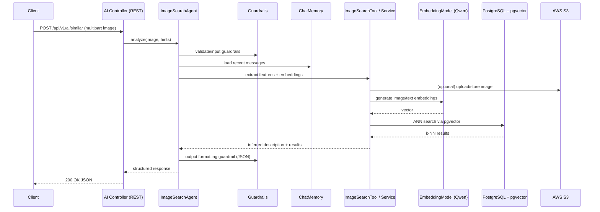

# System Architecture

This document presents the application architecture using Mermaid diagrams, covering system context, containers/modules, AI agent orchestration, core request flows, and deployment views.

> **Tech versions**: Java 25, Spring Boot 3.5.4, LangChain4j 1.8.0, PostgreSQL + pgvector, Redis/Redisson + Caffeine, AWS SDK 2.31.x

---

## 1) System Context (C4 - Level 1)

---

## 2) Containers & Modules (C4 - Level 2)

> **Notes**:
> - Packages align with `README` module structure and `src/main/java/com/dreamhouse/ai/...`.
> - `LLMConfiguration` wires agents, tools, models, guardrails, and chat memory.

---

## 3) AI Agents Orchestration

> **Key points**:
> - Input guardrails run **before** model/tool calls.
> - Output guardrails enforce **JSON formatting** and size limits.
> - `MessageWindowChatMemory` provides **per-session context** with a bounded window.
> - Listeners enable **tool-calling flows** for house and image search.

---

## 4) Sequence: Natural Language Property Search

---

## 5) Sequence: Image Similarity Search

---

## 6) Deployment View (Runtime Options)

